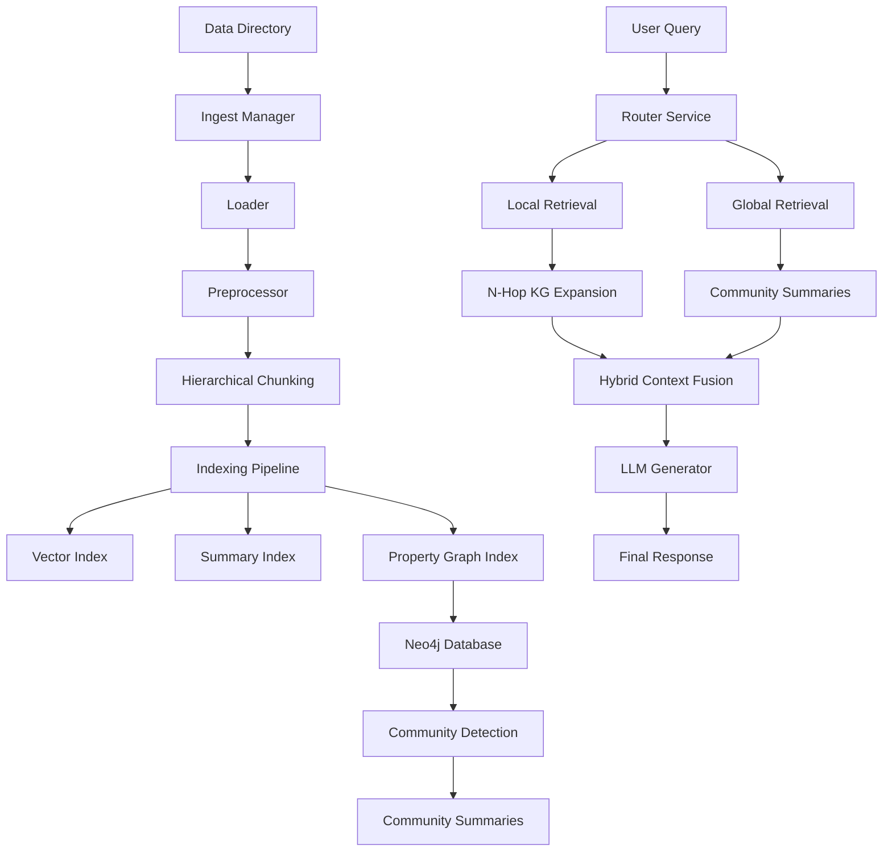

# Technical Specifications - Local Hybrid RAG

This document outlines the technical architecture and specifications for the Local Hybrid RAG system, which implements a "Light RAG" and "GraphRAG" hybrid approach for context-aware information retrieval.

## 1. System Architecture Overview

The system is designed as a modular pipeline that connects various local-first components (LLMs, Embeddings, Graph Databases) to provide both granular fact-based and global thematic answers.

## 2. Ingestion & Preprocessing

The ingestion pipeline converts raw files into a structured format optimized for both vector and graph indexing.

### Smart Loading
- **Modules**: [loader.py](file:///Users/tengweihao/Projects/local-rag/backend/ingestion/loader.py)
- **Features**: Layout-aware parsing for PDF, DOCX, HTML, and Images.
- **Conversion**: Tables are converted to Markdown; images are described using a Multimodal LLM (Vision) if enabled.

### Preprocessing & Normalization
- **Modules**: [preprocessor.py](file:///Users/tengweihao/Projects/local-rag/backend/ingestion/preprocessor.py)
- **Coreference Resolution**: Uses spaCy or LLM-based heuristics to resolve pronouns (e.g., "he" → "Steve Jobs") to prevent graph fragmentation.
- **Cleaning**: Handles encoding fixes, boilerplate removal, and whitespace normalization.

### Hierarchical Chunking (Small-to-Big)
- **Modules**: [graph_extractor.py](file:///Users/tengweihao/Projects/local-rag/backend/indexing/graph_extractor.py)
- **Big Chunks**: Uses `SemanticSplitterNodeParser` to ensure topic coherence for parent nodes.
- **Small Chunks**: Children are split via `SentenceSplitter` for precise entity/triplet extraction.
- **Agentic Chunking**: Optional LLM-guided split-point detection for complex sections.

## 3. Graph-Based Indexing

The Knowledge Graph (KG) is the system's relational backbone, stored in **Neo4j**.

### Extraction Pipeline
- **Actor-Critic Verification**: `RobustSchemaExtractor` verifies each extracted triplet against the source text to prevent hallucinations.
- **Context-Aware Alignment**: Before extraction, existing graph entities are injected into the prompt to ensure consistent naming and deduplication.
- **Temporal Profiling**: Relationships are profiled with time qualifiers (`valid_from`, `valid_to`).

### Graph Refinement
- **Property Profiling**: `HAS_PROPERTY` triplets are collapsed into native node properties.
- **Entity Promoting**: `entity_type` properties are promoted to Neo4j labels for visual organization and optimized querying.

### Global Analysis (GraphRAG)
- **Community Detection**: Uses the **Louvain algorithm** to detect communities of related entities.
- **Hierarchical Summarization**: LLM generates summaries for these communities, enabling global thematic retrieval.

## 4. Dual-Level Retrieval Paradigm

The retrieval engine uses a router to determine the depth and breadth of the search.

### Local Retrieval (Low-Level)
- **Classification**: `QueryType.LOCAL` (e.g., "What is X?")
- **Mechanism**: Targeted entity search + **N-Hop expansion** (default 1-hop) in the graph to gather immediate relational context.

### Global Retrieval (High-Level)
- **Classification**: `QueryType.GLOBAL` (e.g., "Summarize the key themes.")
- **Mechanism**: Retrieval from `CommunitySummaries` and `SummaryIndex`. This abstracts away granular details for high-level synthesis.

### Hybrid Retrieval
- **Mechanism**: Combines both Local and Global results, fusing them with Rank Fusion (RRF) across Vector, BM25, and Graph sources.

## 5. Answer Generation

Information retrieved from both levels is fused and passed to the LLM:
1. **Context Fusion**: Combines direct triplets, community themes, and document excerpts.
2. **Synthesis**: LLM (Llama 3) generates a contextually rich response with integrated source citations.

## 6. Incremental Update Mechanism

To ensure responsiveness in changing environments:
- **Hash-Based Tracking**: [tracker.py](file:///Users/tengweihao/Projects/local-rag/backend/indexing/tracker.py) monitors file MD5 hashes.
- **Seamless Merging**: Neo4j's `MERGE` semantics allow new data to be integrated into the existing graph without rebuilds.
- **Trigger**: Ingestion can be manual or scheduled via [ingest_manager.py](file:///Users/tengweihao/Projects/local-rag/backend/ingestion/ingest_manager.py).

---
*Created: April 2026*
